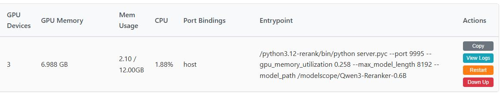
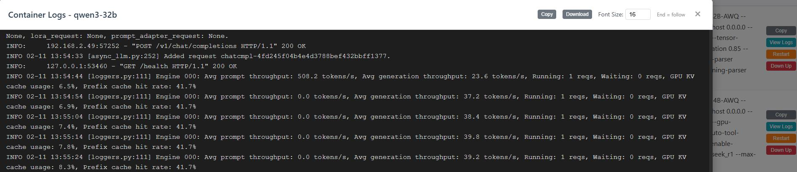

# Docker Monitor

A Docker container monitoring tool with a web UI. The backend is built with **FastAPI**; the frontend is served from the `static` directory.

## Features

### Backend (API)

- **Container list** — List running containers with ID, name, image, ports, GPU devices, compose file path, entrypoint, etc.
- **Live logs** — Stream container logs via SSE (`docker logs -f`).
- **Restart container** — Restart a container by name (password-protected).
- **Down/Up (Compose)** — Run `docker compose down` and `docker compose up -d` for a container (password-protected).

### Frontend (Web UI)

- **Container table** — Sortable, resizable columns; optional auto-refresh.
- **Live logs** — Show container logs with auto-scroll.
- **Restart** — Restart a container by name (password-protected).
- **Down/Up (Compose)** — Run `docker compose down` and `docker compose up -d` for a container (password-protected).

## Requirements

- Python 3.10+ (tested with Python 3.12)
- Docker
- Docker Compose (for restart/down-up)

## Install & Run

Ensure the current user is in the `docker` group so that Docker commands can be run without `sudo`:
```bash
sudo usermod -aG docker $USER
newgrp docker
```

```bash
pip install fastapi fastapi-offline uvicorn[standard] httpx psutil bcrypt
python gen_git_commit.py # generate version.py
python docker_monitor_server.py --host 0.0.0.0 --port 9949
```

- **Web UI:** http://localhost:9949/dm/index.html
- **API docs:** http://localhost:9949/docs
- **Logs download:** http://localhost:9949/logs

### Password (restart / down-up)

Restart and down-up actions are protected by a password stored as a bcrypt hash in `key.json` (do not commit this file).

Generate the hash:

```bash
python generate_password_hash.py --interactive
# or: python generate_password_hash.py --password "your_password"
# restart python server
```

## Project layout

```
docker-monitor/
├── app.py                    # FastAPI app
├── api.py                    # API routes
├── docker_util.py            # Docker helpers
├── process_util.py           # Async process execution
├── docker_monitor_server.py  # Server entry
├── generate_password_hash.py # Password hash tool
├── static/                   # Frontend (HTML, CSS, JS)
└── README.md
```

## License

MIT.

## Snapshots

**Container list**



**Live logs**


