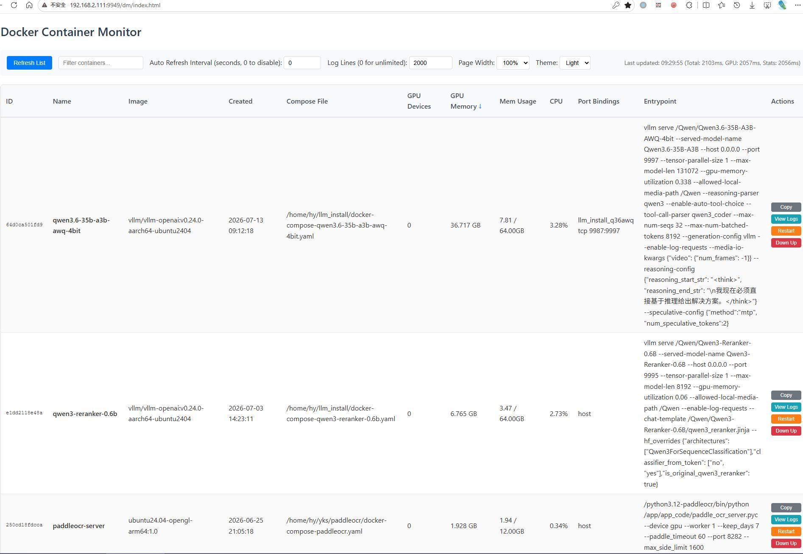
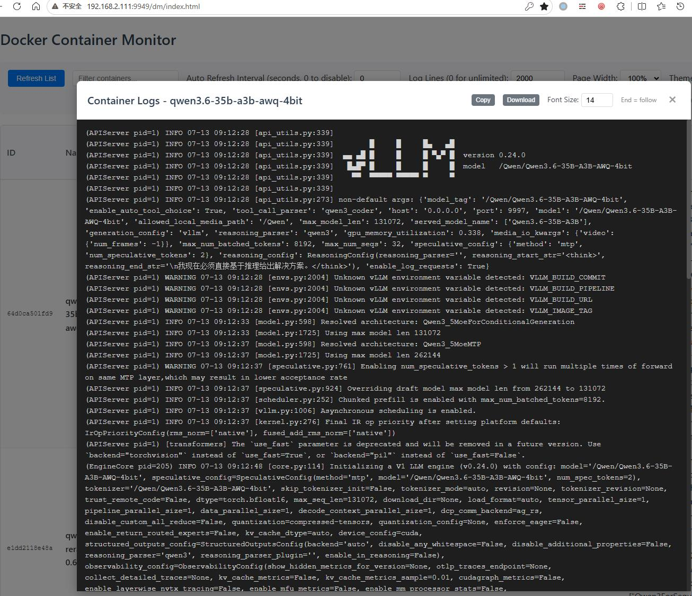

# Docker Monitor

A Docker container monitoring tool with a web UI. The backend is built with **FastAPI**; the frontend is served from the `static` directory.

**中文文档 / Chinese documentation:** [README-cn.md](README-cn.md) · **Implementation details:** [docs/implementation.md](docs/implementation.md)

## Features

### Backend (API)

- **Container list** (`GET /api/containers`) — ID, name, image, ports, GPU/NPU devices, compose file, entrypoint, etc. via `docker inspect`
- **Containers overview** (`GET /api/containers/overview`) — aggregated list + GPU/NPU usage + stats (used after initial page load)
- **GPU/NPU usage** (`GET /api/gpu/usage`) — NVIDIA (`nvidia-smi`) or Huawei Ascend (`npu-smi info`); maps memory to containers
- **Container stats** (`GET /api/containers/stats`) — CPU, memory, network and disk I/O via `docker stats --no-stream`
- **Healthcheck** (`GET /api/containers/{id}/healthcheck`) — probe container health URL from backend
- **HTTP proxy** (`POST /api/request`) — forward HTTP requests with optional local-IP blocking
- **Live logs** (`GET /api/containers/{id}/logs`) — stream logs via SSE (`docker logs -f`)
- **Restart** (`POST /api/containers/{name}/restart`) — `docker restart`, password-protected
- **Down/Up** (`POST /api/containers/{id}/downup`) — `docker compose down && up -d`, password-protected (SSE stream variant available)

> How GPU IDs, GPU memory, and container memory are collected: **[docs/implementation.md](docs/implementation.md)**

### Frontend (Web UI)

- **Container table** — sortable, resizable columns; auto-refresh; GPU memory and CPU/memory loaded asynchronously
- **Live logs** — auto-scroll log viewer
- **Restart / Down-Up** — password-protected compose operations

## Requirements

- Python 3.10+ (tested with Python 3.12)
- Docker
- Docker Compose (for restart/down-up): `docker compose` (V2) or `docker-compose` (V1), auto-detected
- **GPU/NPU monitoring (optional):** `nvidia-smi` (NVIDIA) or `npu-smi` (Huawei Ascend); auto-detected at runtime

## Install & Run

Ensure the current user is in the `docker` group:

```bash
sudo usermod -aG docker $USER
newgrp docker
```

```bash
pip install fastapi fastapi-offline uvicorn[standard] httpx psutil bcrypt
python gen_git_commit.py   # generate version.py
python docker_monitor_server.py --host 0.0.0.0 --port 9949
```

- **Web UI:** http://localhost:9949/dm/index.html
- **API docs:** http://localhost:9949/docs
- **Health:** http://localhost:9949/health

### Password (restart / down-up)

Password is stored as a bcrypt hash in `key.json` (do not commit):

```bash
python generate_password_hash.py --interactive
# restart the server after updating key.json
```

## Project layout

```
docker-monitor/
├── app.py                    # FastAPI app
├── api.py                    # API routes
├── docker_util.py            # Docker & metrics helpers
├── process_util.py           # Async command execution
├── docker_monitor_server.py  # Server entry
├── generate_password_hash.py
├── static/                   # Frontend (HTML, CSS, JS)
├── docs/
│   └── implementation.md     # Container metrics collection (CN)
├── README.md                 # This file
└── README-cn.md              # Chinese documentation
```

## License

MIT.

## Snapshots

**Container list**



**Live logs**


