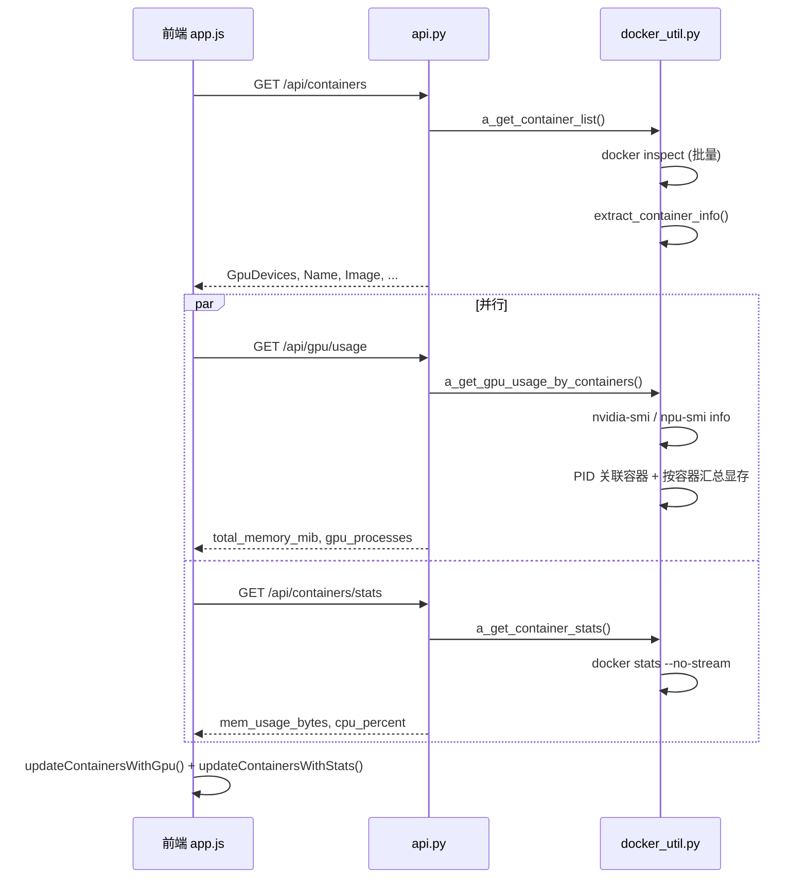

# 容器信息采集实现说明

**English README:** [README.md](../README.md) · **中文 README:** [README-cn.md](../README-cn.md)

本文档说明监控页面各列数据的**后端采集方式**与**前端组装逻辑**，核心代码位于 `docker_util.py`、`api.py`、`static/app.js`。

---

## 1. 总体流程

页面刷新时分三阶段异步加载，避免等待最慢的 GPU 查询阻塞列表展示：

```
阶段 1  GET /api/containers          → 容器基础信息（含 GpuDevices）
阶段 2  GET /api/gpu/usage           → 加速器显存（GPU/NPU）
        GET /api/containers/stats    → 容器 CPU / 内存
阶段 3  前端 merge                   → 更新表格各列
```



| 页面列 | API 字段 | 数据来源 |
|--------|----------|----------|
| 显卡序号 | `GpuDevices` | `docker inspect` |
| GPU Memory | `total_memory_mib` | `nvidia-smi` / `npu-smi info` |
| 内存占用 | `mem_usage_bytes` / `mem_limit_bytes` | `docker stats --no-stream` |
| CPU | `cpu_percent` | `docker stats --no-stream` |

---

## 2. 容器基础信息（`GET /api/containers`）

### 2.1 命令

```bash
docker ps -q                          # 获取运行中容器 ID 列表
docker inspect <id1> <id2> ...        # 一次性批量 inspect
```

实现函数：`a_inspect_all_containers()` → `extract_container_info()`

### 2.2 主要字段提取

| 返回字段 | inspect 路径 | 说明 |
|----------|--------------|------|
| `Id` | `.Id` | 完整 64 位容器 ID |
| `Name` | `.Name` | 去掉前缀 `/` |
| `Image` | `.Config.Image` | 镜像名 |
| `Created` | `.Created` | 创建时间 |
| `State` | `.State` | 状态；会删除 `Health.Log` 减小体积 |
| `PortBindings` | `.HostConfig.PortBindings` | 端口映射 |
| `NetworkMode` | `.HostConfig.NetworkMode` | 如 `host`、`bridge` |
| `Memory` / `MemorySwap` | `.HostConfig.Memory` 等 | 容器内存上限（字节，0=不限） |
| `HealthcheckTest` | `.Config.Healthcheck.Test` | 正则提取 `http(s)://...` URL |
| `ComposeFile` | `.Config.Labels["com.docker.compose.project.config_files"]` | compose 文件路径 |
| `Entrypoint` | `.Config.Entrypoint` | 入口命令 |
| `DeviceRequests` | `.HostConfig.DeviceRequests` | 原始 NVIDIA 设备请求 |
| **`GpuDevices`** | 见下文 | **显卡/NPU 序号列表** |

---

## 3. 显卡/NPU 序号（`GpuDevices`）

`GpuDevices` 是字符串数组，如 `["0", "1"]`，表示容器可见的加速器编号。前端「显卡序号」列直接 `join(", ")` 展示。

### 3.1 NVIDIA

从 `HostConfig.DeviceRequests` 中筛选 `Driver == "nvidia"`：

```json
"DeviceRequests": [{
  "Driver": "nvidia",
  "Count": 0,
  "DeviceIDs": ["0", "1"],
  "Capabilities": [["gpu"]]
}]
```

- `DeviceIDs` 有值 → 追加到 `GpuDevices`
- `Count == -1` 且无 `DeviceIDs` → 表示全部 GPU，追加 `"all"`

实现：`_extract_nvidia_gpu_devices()`

### 3.2 华为 Ascend

Ascend 容器通常**没有** NVIDIA 式 `DeviceRequests`，而是通过设备文件挂载：

```json
"HostConfig": {
  "Runtime": "ascend",
  "Devices": [
    {"PathOnHost": "/dev/davinci0", "PathInContainer": "/dev/davinci0"},
    {"PathOnHost": "/dev/davinci1", "PathInContainer": "/dev/davinci1"}
  ]
}
```

解析规则（`_extract_ascend_gpu_devices()`）：

1. 匹配 `HostConfig.Devices` 中路径 `/dev/davinci{N}` → 提取 `N`
2. 若仍为空，读取环境变量：
   - `ASCEND_VISIBLE_DEVICES=0,1`
   - `ASCEND_RT_VISIBLE_DEVICES=0,1`

> 辅助设备如 `/dev/davinci_manager`、`/dev/hisi_hdc` **不会**计入 `GpuDevices`。

---

## 4. 加速器显存（`GET /api/gpu/usage`）

### 4.1 厂商检测

`detect_accelerator_vendor()` 在主机上自动判断，结果会缓存：

| 条件 | 厂商 |
|------|------|
| 存在 `/dev/nvidia0` 或 `nvidia-smi` 在 PATH | `nvidia` |
| 存在 `/dev/davinci0` 或能解析到 `npu-smi` 可执行文件 | `ascend` |
| 均不满足 | 不采集，返回 `{}` |

`npu-smi` 常见路径为 `/usr/local/sbin/npu-smi`。systemd/精简 PATH 下会用 `_resolve_executable()` 解析**绝对路径**再执行，避免 `FileNotFoundError`。

### 4.2 NVIDIA：`nvidia-smi`

**命令：** `nvidia-smi`

**解析 Processes 段**（`parse_nvidia_smi_output()`）：

```
|    0   N/A  N/A    3605966   C   VLLM::Worker_TP0   22062MiB |
       ↑ gpu_id              ↑ pid                      ↑ memory_mib
```

### 4.3 Ascend：`npu-smi info`

**命令：** 解析后的绝对路径，例如 `/usr/local/sbin/npu-smi info`（非裸 `npu-smi`，避免 PATH 不含 sbin）

输出分两部分：

**（1）设备 HBM 总量** — `_parse_npu_hbm_usage()`

```
| 0     910B2  | OK | ... |
| 0            | 0000:C1:00.0 | 0 | 0/0 | 60284/ 65536 |
                                              ↑used  ↑total (MB)
```

附加到同 NPU 编号进程的 `device_memory_used_mb`、`device_memory_total_mb` 字段（供 tooltip 参考）。

**（2）进程显存** — `parse_npu_smi_output()`

```
| 0  0  | 1217362  | VLLMWorker_TP  | 56934 |
   ↑         ↑                           ↑
 npu_id     pid                  memory_mib (Process memory MB)
```

容器占用的显存 = **归属于该容器**的所有进程 `memory_mib` 之和（完整步骤见 **§4.4**）。

> `60284/65536` 是设备级 HBM 总量，**不能**直接按 `GpuDevices` 设备号分配给容器——多个容器可能共用同一块 GPU/NPU。

### 4.4 PID 显存 → 容器显存（完整链路）

这是 GPU Memory 列的核心算法，NVIDIA 与 Ascend **完全相同**，由 `a_get_gpu_usage_by_containers()` 编排。

#### 步骤概览

```
┌─────────────────────────────────────────────────────────────────┐
│ 1. 执行 smi 命令，解析出进程列表 gpu_processes[]                  │
│    每条: { gpu_id, pid, process_name, memory_mib }              │
└────────────────────────────┬────────────────────────────────────┘
                             ▼
┌─────────────────────────────────────────────────────────────────┐
│ 2. 对每个 pid，查它属于哪个容器（a_map_pids_to_containers）       │
│    命中缓存 → 直接用；新 pid → cgroup，失败则 docker top        │
│    得到: pid_to_container = { 1217362: "c0bfefa6...", ... }     │
└────────────────────────────┬────────────────────────────────────┘
                             ▼
┌─────────────────────────────────────────────────────────────────┐
│ 3. 按容器分组，累加 memory_mib（_merge_processes_into_container）│
│    同一容器下多条进程 → total_memory_mib = Σ memory_mib          │
└────────────────────────────┬────────────────────────────────────┘
                             ▼
┌─────────────────────────────────────────────────────────────────┐
│ 4. 返回 /api/gpu/usage → 前端显示 gpuMemoryDisplay              │
└─────────────────────────────────────────────────────────────────┘
```

#### Ascend 实例（来自 `ascend-npu/npu-smi.log`）

**smi 解析结果（步骤 1）：**

| gpu_id | pid | process_name | memory_mib |
|--------|-----|--------------|------------|
| 0 | 1217362 | VLLMWorker_TP | 56934 |
| 1 | 1217565 | VLLMWorker_TP | 56934 |

**PID → 容器（步骤 2）：**

| pid | 查 cgroup / docker top | 容器 ID |
|-----|------------------------|---------|
| 1217362 | `/proc/1217362/cgroup` 含 `docker/c0bfefa6...` | `c0bfefa6064b...` |
| 1217565 | 同上 | `c0bfefa6064b...` |

（两个 worker 进程都在同一容器 `qwen3.6-27b-w8a8` 内。）

**按容器汇总（步骤 3）：**

```
容器 c0bfefa6064b... :
  gpu_processes = [ {gpu_id:0, pid:1217362, memory_mib:56934},
                    {gpu_id:1, pid:1217565, memory_mib:56934} ]
  total_memory_mib = 56934 + 56934 = 113868
  gpu_ids = [0, 1]
```

**前端展示（步骤 4）：** `113868 / 1024 ≈ 111.199 GB`

#### 多容器共用同一块 GPU

| 容器 | GpuDevices | smi 进程 | PID 归属 | 容器显存 |
|------|------------|----------|----------|----------|
| A | `["0"]` | PID 100, GPU0, 8192 MB | cgroup → A | **8192** |
| B | `["0"]` | PID 200, GPU0, 4096 MB | cgroup → B | **4096** |

A、B 都挂载了 GPU 0，但 **`GpuDevices` 不参与显存计算**；各自只加属于自己的 PID。

#### 不能用的做法（已明确禁止）

| 做法 | 为何不行 |
|------|----------|
| 按 `GpuDevices` 把 NPU 0 上所有进程算给某容器 | 共用 GPU 时会算错容器，或算给错误的那个 |
| 用 HBM `60284/65536` 整卡用量给容器 | 那是设备总量，含其他容器/进程的占用 |

#### 关键代码

| 步骤 | 函数 |
|------|------|
| 1 解析 smi | `parse_nvidia_smi_output()` / `parse_npu_smi_output()` |
| 2 PID→容器 | `a_map_pids_to_containers()` |
| 3 按容器累加 | `_merge_processes_into_container_info()` |
| 总入口 | `a_get_gpu_usage_by_containers()` |

### 4.5 进程如何关联到容器

对每个 **尚未命中缓存** 的 smi 进程 PID，在**全部运行中容器**里查归属：

1. **`/proc/<pid>/cgroup`** — 读 cgroup 路径中的 `docker/<容器ID>`
2. **`docker top <cid> -o pid`** — 每行一个 PID；解析失败时回退完整表格

实现：`a_build_container_pid_sets()` → `_parse_docker_top_pids()`

### 4.6 性能与缓存

**PID → 容器缓存**（进程级，跨请求保留）：

- 命中条件：`/proc/<pid>` 仍存在，且映射的容器仍在运行
- **缓存命中**：直接复用，不再 cgroup / docker top
- **新 PID**：仅对未缓存的 PID 做 cgroup → docker top 查找，成功后写入缓存
- **失效**：进程退出或容器停止时，下次映射前自动 prune

**容器 PID 列表缓存**（2 秒 TTL）：

- 当仍有 PID 需要 docker top 回退时，复用近期对各容器执行的 `docker top -o pid` 快照
- 容器列表变化（增删）时自动失效

`GET /api/containers` 的 GpuDevices 缓存仅用于前端「显卡序号」，不参与显存分摊。

### 4.7 API 返回结构

```json
{
  "<container_id>": {
    "gpu_processes": [
      {
        "gpu_id": 0,
        "pid": 1217362,
        "process_name": "VLLMWorker_TP",
        "memory_mib": 56934,
        "device_memory_used_mb": 60284,
        "device_memory_total_mb": 65536
      }
    ],
    "total_memory_mib": 113868,
    "gpu_ids": [0, 1]
  }
}
```

- `memory_mib`：进程占用显存（NVIDIA 为 MiB，Ascend 为 npu-smi 报告的 MB，字段名统一）
- `total_memory_mib`：该容器所有加速器进程显存之和
- `gpu_ids`：涉及的去重设备编号

---

## 5. 容器 CPU / 内存（`GET /api/containers/stats`）

### 5.1 命令

```bash
docker stats --no-stream <id1> <id2> ...
```

实现：`a_get_container_stats()` → `parse_docker_stats_output()`

### 5.2 返回字段

| 字段 | 含义 | 前端展示 |
|------|------|----------|
| `cpu_percent` | CPU 使用率（可 >100%，多核） | `203.09%` |
| `mem_usage_bytes` | 当前内存占用（字节） | 换算为 GB |
| `mem_limit_bytes` | 内存上限（字节） | 换算为 GB |
| `mem_percent` | 内存占用百分比 | — |
| `net_io_rx` / `net_io_tx` | 网络 I/O（字节） | — |
| `block_io_read` / `block_io_write` | 磁盘 I/O（字节） | — |
| `pids` | 进程数 | — |

前端格式（`updateContainersWithStats()`）：

```
memUsageDisplay = "10.11 / 64.00GB"
cpuDisplay      = "15.80%"
```

`mem_limit_bytes == 0` 表示 Docker 未设内存限制，解析时按 unlimited 处理。

---

## 6. 前端组装（`static/app.js`）

### 6.1 刷新顺序

```javascript
// 1. 容器列表
fetch('/api/containers')  → processContainers()  → 渲染表格（显存列暂为 "-"）

// 2. 并行
fetch('/api/gpu/usage')           → gpuUsage = data
fetch('/api/containers/stats')    → containerStats = data

// 3. 合并
updateContainersWithGpu()    // 填充 gpuMemoryDisplay
updateContainersWithStats()  // 填充 memUsageDisplay, cpuDisplay
```

### 6.2 容器 ID 匹配

API 返回的 key 可能是 12 位或 64 位 ID。`findGpuInfo()` / `findContainerStats()` 依次尝试：

1. 完整 `container.Id` 精确匹配
2. 前 12 位短 ID
3. 前缀互相包含匹配

### 6.3 页面列与代码

| 列 | 前端字段 | 来源 |
|----|----------|------|
| 显卡序号 | `gpuDevices` | `container.GpuDevices.join(', ')` |
| GPU Memory | `gpuMemoryDisplay` | `total_memory_mib / 1024` → `"111.199 GB"` |
| 内存 | `memUsageDisplay` | stats 的 usage/limit |
| CPU | `cpuDisplay` | stats 的 `cpu_percent` |

GPU Memory 悬停 tooltip 为 `gpu_processes` 的 JSON 字符串。

---

## 7. 关键源码索引

| 功能 | 文件 | 函数 |
|------|------|------|
| 批量 inspect | `docker_util.py` | `a_inspect_all_containers()` |
| 字段提取 | `docker_util.py` | `extract_container_info()` |
| NVIDIA GpuDevices | `docker_util.py` | `_extract_nvidia_gpu_devices()` |
| Ascend GpuDevices | `docker_util.py` | `_extract_ascend_gpu_devices()` |
| 厂商检测 | `docker_util.py` | `detect_accelerator_vendor()` |
| 显存解析 | `docker_util.py` | `parse_nvidia_smi_output()`, `parse_npu_smi_output()` |
| PID→容器 | `docker_util.py` | `a_map_pids_to_containers()`, `_lookup_pids_to_containers()` |
| 按容器累加显存 | `docker_util.py` | `_merge_processes_into_container_info()`, `a_get_gpu_usage_by_containers()` |
| docker top 快照 | `docker_util.py` | `a_build_container_pid_sets()`, `_get_container_pid_sets_cached()` |
| docker stats | `docker_util.py` | `a_get_container_stats()` |
| API 路由 | `api.py` | `get_containers`, `get_gpu_usage`, `get_container_stats` |
| 前端合并 | `static/app.js` | `refreshContainers`, `updateContainersWithGpu`, `updateContainersWithStats` |

---

## 8. 参考样例

项目内可参考的真实输出：

| 文件 | 用途 |
|------|------|
| `ascend-npu/npu-smi.log` | Ascend `npu-smi info` 样例 |
| `ascend-npu/qwen3.6-27-container-inspect.log` | Ascend 容器 inspect 样例 |
| `docker-inspect.json` | NVIDIA 容器 inspect 样例 |
| `api_gpu_usage.json` | NVIDIA GPU usage API 样例 |

---

## 9. 常见问题

**Q: 显卡序号有值，但 GPU Memory 为 `-`？**

- 说明 smi 有输出，但进程 PID 未能映射到容器（cgroup / docker top 均失败）
- 检查监控进程是否有权限读 `/proc/<pid>/cgroup`、执行 `docker top`
- 浏览器控制台查看 `[GPU] Loaded GPU usage data for N containers`

**Q: 两个容器都用 GPU 0，显存怎么算？**

- 各容器只累计**属于自己 PID** 的 smi 显存，不会按 `GpuDevices` 整卡分摊

**Q: Ascend 上显存数值单位？**

- 进程 `memory_mib` 对应 npu-smi 的 **Process memory(MB)**
- 设备 `device_memory_total_mb` 对应 HBM 总量（如 65536 MB）
- 前端统一除以 1024 显示 GB

**Q: 容器内存与 GPU 显存区别？**

- **容器内存**：Docker cgroup 内的 RAM 占用（`docker stats`）
- **GPU/NPU 显存**：加速器 HBM/VRAM 上的占用（`nvidia-smi` / `npu-smi`），两者独立
